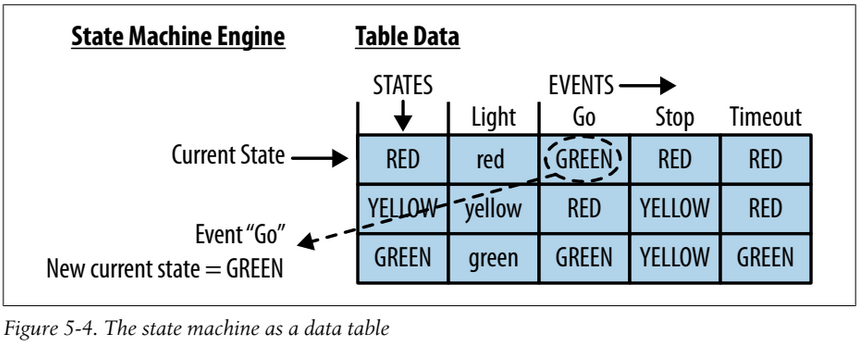
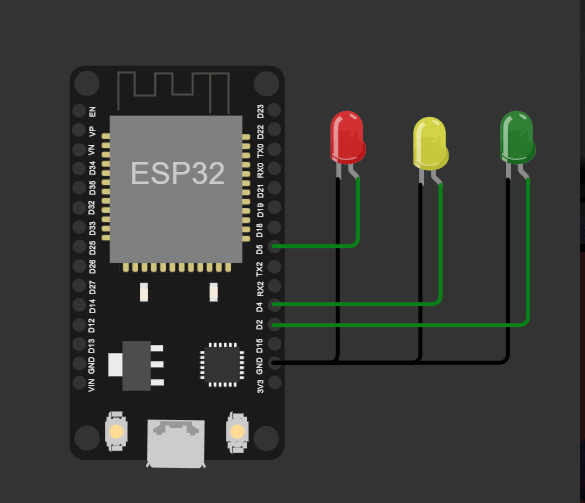
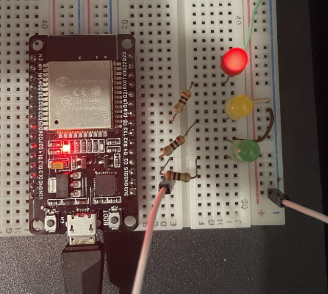

# Semaforo-ESP32-com-multi-threading

Esse projeto tem como objetivo implementar a máquina de estados para um semáforo como descrito na tabela a seguir:

O semafóro funciona de modo que é possível modificar o estado por meio de mensagens enviadas pelo monitor serial. Uma __thread__ executa o processamento I/O e fluxo de controle da maquina de estados. Uma outra __thread__ é responsável por controlar de maneira automática o estado do semáforo relaizando transições sucessivas de eventos do tipo:

`Go -> Stop -> Timeout -> Go -> ...`

# Instalação e funcionamento

Para buildar o projeto é necessário utilizar o PlatformIO. Clonar o repositório e selecionar o modelo da placa ESP32 respectivo (no nosso caso foi o uPesy ESP32 Wroom DevKit). Em seguida basta buildar o projeto e fazer upload do firmware. O circuito é simples de ser montado e consiste basicamente em três leds representando cada luz do semáforo:

* LED_RED: PINO D5
* LED_YELLOW: PINO D4
* LED_GREEN: PINO D2

A seguir temos uma foto do circuito montado fisicamente:

Links externos úteis: 

Playlist do Youtube Arduino e ESP32 - https://www.youtube.com/playlist?list=PLzvRQMJ9HDiQ3OIuBWCEW6yE0S0LUWhGU
